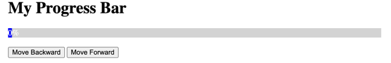
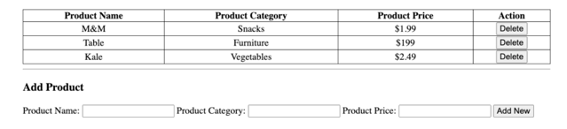

**Coding Question**:
1. what is the output? why?
    ```js//
    for (var i = 0; i < 3; i++) {
        setTimeout(function () {
            console.log(i);
        }, 1000);
    }
    //
    ```
    > I want the output to be “0, 1, 2”, please provide two different methods
    >> Hint 1: Use block scope
    >> Hint 2: Use closure
<br />

2. Consider the following code snippet. Create a function named add2 that does the exact same thing but can be invoked in this way: add2(num1)(num2)(num3)
    ```js//
    function add(num1, num2, num3){
        return num1 + num2 + num3
    }
    //
    ```

3. Given an array of students
    ```json
    [{name:”u1”, age:19, gender:1},
    {name:”u2”, age:24, gender:2},
    {name:”u3”, age:44, gender:1}]
    ```
    return the users whose age is larger than 22 and gender is 1, sorted by username descending order
<br />
4. Implement a closure function named myFn(). If you call myFn(), it returns 1. Calling myFn() consecutively should return 2, 3, 4, …
<br />
5. Implement a progressive bar with HTML, CSS & JS. When the user presses “Move Forward’, the bar will move 10% forward; when the user presses “Move Backward”, it will decrease 10%. When it’s 100% and the user presses “Move Forward”, it will show an alert window that says “Maximum”.

<br />
6. Given the sample UI, implement the following product management page with styling that matches as closely as possible.
- The user can fill out the fields and click “Add New” to create a new product in the table.
However, if any of the input fields are empty, no product should be created.
- The user can delete existing products in the table by clicking the delete button.
- By default, when the user loads the page for the first time, there should be these 3 items in the table as shown below.


